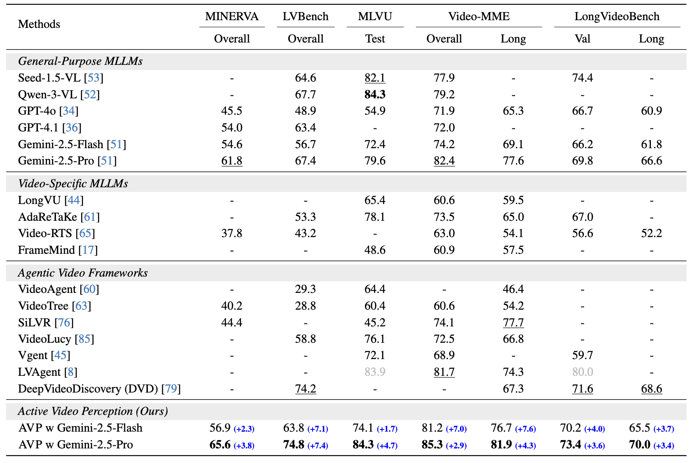

# Active Video Perception: Iterative Evidence Seeking for Agentic Long Video Understanding

<div align="center">

[](https://activevideoperception.github.io/)
[](https://arxiv.org/abs/2512.05774)
[](https://www.youtube.com/watch?v=15SxSE1A0Ow)

</div>


[Ziyang Wang](https://ziyangw2000.github.io/)<sup>1,2*</sup>, [Honglu Zhou](https://sites.google.com/view/hongluzhou/)<sup>1</sup>,[Shijie Wang](https://wang-sj16.github.io/)<sup>1</sup>, [Junnan Li](https://scholar.google.com/citations?user=MuUhwi0AAAAJ&hl=en)<sup>1</sup>, [Caiming Xiong](http://cmxiong.com/)<sup>1</sup>, [Silvio Savarese](https://www.salesforce.com/blog/author/silvio-savarese/)<sup>1</sup>, [Mohit Bansal](https://www.cs.unc.edu/~mbansal/)<sup>2</sup>, [Michael S. Ryoo](https://scholar.google.com/citations?user=vcw0TJIAAAAJ&hl=en)<sup>1</sup>, [Juan Carlos Niebles](https://www.niebles.net/)<sup>1</sup>

<sup>1</sup> Salesforce AI Research  
<sup>2</sup> UNC Chapel Hill  
<sup>*</sup> Work done during internship at Salesforce

---

<div align="center">
  
</div>

<br>

## Table of Contents
- [Highlights](#highlights-)
- [Setup](#setup)
- [Evaluation Code](#parallel-evaluation)
- [Citation](#citation-)

---

## Highlights


**Active Video Perception (AVP)** is an evidence-seeking framework that treats the video as an interactive environment and acquires compact, queryrelevant evidence directly from pixels.

**Key ideas:**
- Treat long videos as **interactive environments**
- Iteratively **plan → observe → reflect** to seek evidence
- Allocate computation **adaptively** to informative regions
- Improve **grounding, efficiency, and reasoning faithfulness**

AVP consistently improves over strong MLLM backbones and prior agentic frameworks across multiple long video understanding benchmarks.

<div align="center">
  
</div>

<br>

<div align="center">
  
</div>

<br>

---

## Setup

### 1. Create Conda Environment
Create and activate a fresh conda environment with the required Python version:

```bash
conda create -n avp python=3.10 -y
conda activate avp
```

### 2. Install System Dependencies

```bash
conda install -c conda-forge ffmpeg
ffmpeg -version
pip install -r requirements.txt
```

### 3. Setup Annotation Files and Config Files

Before running evaluation, please download the videos from original benchmark huggingface and update the video paths of the annotation file in `avp/eval_anno/` and update the Gemini API information in `avp/config.example.json`.

For API Keys: 

**Vertex AI (default):** Set `project` and `location` in config for GCP Vertex AI.

**API key (Google AI Studio):** Set the `GEMINI_API_KEY` environment variable (or optional `api_key` in config).

---
## Evaluation Code

Set these in `avp/parrelel_run.sh` before running:

- **ANNOTATION_FILE** – Path to your annotation JSON
- **OUTPUT_DIR** – Directory where results will be written
- **CONFIG_FILE** – Path to your config JSON (e.g. `config.example.json`)

Optional (with defaults):

- **LIMIT** – Max number of samples (omit for no limit)
- **MAX_TURNS** – Max plan–execute cycles per sample (default: 3)
- **NUM_WORKERS** – Number of parallel workers (default: 4)
- **TIMEOUT** – Timeout per sample in seconds, prevent API failure (omit for no timeout, suggested to use)

Example Script:

```bash
bash avp/parrelel_run.sh
```

---

## Citation

If you find our work useful, please cite:

```bibtex
@misc{wang2025activevideoperceptioniterative,
      title={Active Video Perception: Iterative Evidence Seeking for Agentic Long Video Understanding}, 
      author={Ziyang Wang and Honglu Zhou and Shijie Wang and Junnan Li and Caiming Xiong and Silvio Savarese and Mohit Bansal and Michael S. Ryoo and Juan Carlos Niebles},
      year={2025},
      eprint={2512.05774},
      archivePrefix={arXiv},
      primaryClass={cs.CV},
      url={https://arxiv.org/abs/2512.05774}, 
}