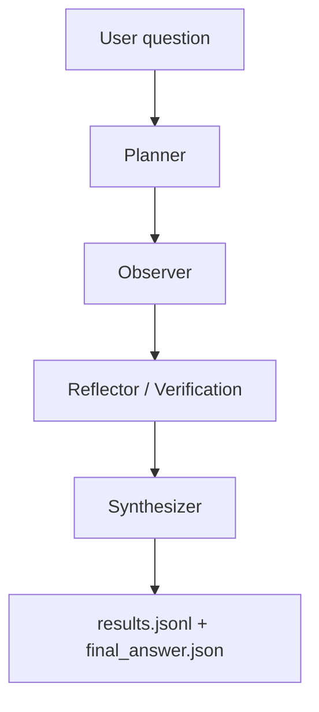

# Gemini Q2 Problem-Solving Process Reconstruction

Generated from the actual local run at `avp/out/gemini_yunwu_q2/`.

## Reference baseline

This reconstruction follows the documentation style and role breakdown used in `agent_interaction_reconstruction_5q.md`. The user-provided path used spaces/case variants, but the actual reference file in the repository is:

- `/home/guoxiangyu/pytorch_project/ActiveVideoPerception/agent_interaction_reconstruction_5q.md`

## Sample identity

- Sample ID: `Basketball_Full_001_1_2`
- Video ID: `Basketball_Full_001_1`
- Task type: `感知推理`
- Question: `比赛开始后，俄克拉荷马城雷霆队在得到前8分的过程中，总共完成了多少次三分出手？`
- Ground-truth answer: `2次`
- Run directory: `/home/guoxiangyu/pytorch_project/ActiveVideoPerception/avp/out/gemini_yunwu_q2/all_sample/sample_0`
- Model: `gemini-2.5-pro`
- Batch summary accuracy for this run: `1/1 = 1.0000`

## Final outcome

- Final saved answer shape: pseudo-MCQ JSON
- `selected_option`: `A`
- `selected_option_text`: `2次`
- `confidence`: `0.95`
- `query_confidence`: `0.8`
- Evaluation result: `correct = true`

Although the answer content was correct, the original Gemini pipeline still forced open-ended QA into an MCQ-style envelope, using `selected_option="A"` as a placeholder and putting the real answer in `selected_option_text`.

## Execution timeline



### Recorded attempts from `results.jsonl`

- Attempt 1: failed with `404 None. {'error': {'message': 'Invalid URL (POST /v1/v1beta/models/gemini-2.5-pro:generateContent)', 'type': 'invalid_request_error', 'param': '', 'code': ''}}`
- Attempt 2: failed with `401 None. {'error': {'message': 'Invalid token (request id: 20260320164531167160322LIUVWZK6)', 'message_zh': '无效的令牌', 'type': 'new_api_error'}}`
- Attempt 3: succeeded with `predicted=A` and `correct=True`


This shows the practical debugging sequence for this exact sample:

1. First request failed because the endpoint path expanded into `/v1/v1beta/...`, producing an invalid URL.
2. Second request reached the provider but failed authentication (`Invalid token`).
3. Third request completed successfully and produced the correct answer content.

## Agent-by-agent reconstruction

### 1. Planner

Source: `/home/guoxiangyu/pytorch_project/ActiveVideoPerception/avp/out/gemini_yunwu_q2/all_sample/sample_0/plan.initial.json`

- Planning objective: `Analyze the start of the game to identify the time period when the Oklahoma City Thunder score their first 8 points, and count the number of three-point shots they attempted during this period.`
- Completion criteria: `The observation is complete when the number of three-point attempts made by the Thunder while scoring their first 8 points has been counted.`
- Watch mode: `region`
- FPS: `2.0`
- Spatial token rate: `medium`
- Planned region: `0.0s - 240.0s`

Interpretation: the Planner correctly recognized that the question concerns the opening scoring run, so it searched the first 240 seconds of the game at medium spatial detail and 2.0 FPS.

### 2. Observer

Source: `/home/guoxiangyu/pytorch_project/ActiveVideoPerception/avp/out/gemini_yunwu_q2/all_sample/sample_0/evidence/round_1/evidence.json`

- Observed frame interval(s): `[{'start': 0.0, 'end': 240.0, 'fps': 2.0}]`
- Prompt version: `v2_structured`
- Execute model: `gemini-2.5-pro`
- Media resolution: `medium`

#### Key evidence extracted

- `128s - 132s`: 拉塞尔·威斯布鲁克上篮得分，雷霆队得到前2分。比分 2-0。
- `155s - 159s`: 凯文·杜兰特命中三分球，这是雷霆队的第一次三分出手。比分 5-0。
- `184s - 187s`: 安德烈·罗伯森命中三分球，这是雷霆队的第二次三分出手，总得分达到8分。比分 8-0。


Observer conclusion: the model localized three scoring events and correctly identified that the second and third scores were both made three-pointers, yielding a total of `2` three-point attempts before the Thunder reached 8 points.

### 3. Reflector / Verification

Source: `/home/guoxiangyu/pytorch_project/ActiveVideoPerception/avp/out/gemini_yunwu_q2/all_sample/sample_0/history.jsonl`

- Reflection event count: `1`
- Final verification payload: `{'sufficient': True, 'should_update': False, 'updates': [], 'reasoning': 'Evidence analysis: 2 round(s), 3 unique region(s) after dedup/merge, 6 total evidence items. Query confidence: 0.80', 'confidence': 0.8, 'query_confidence': 0.8, 'event': 'VERIFICATION'}`

Interpretation: the runtime judged the evidence sufficient after the observation phase and set `query_confidence=0.8`, so it stopped searching and moved to synthesis.

### 4. Synthesizer

Source: `/home/guoxiangyu/pytorch_project/ActiveVideoPerception/avp/out/gemini_yunwu_q2/all_sample/sample_0/final_answer.json`

Saved output:

```json
{
  "selected_option": "A",
  "confidence": 0.95,
  "reasoning": "比赛开始后，俄克拉荷马城雷霆队通过三次有效的进攻得到了前8分。首先是拉塞尔·威斯布鲁克在128.0s-132.0s通过上篮得到2分（2-0）；接着是凯文·杜兰特在155.0s-159.0s命中一记三分球，得到3分（5-0），这是第一次三分出手；随后安德烈·罗伯森在184.0s-187.0s再次命中一记三分球，得到3分，使总得分达到8分（8-0），这是第二次三分出手。根据证据显示，在此过程中雷霆队总共完成了2次三分球出手，且两次均命中。",
  "selected_option_text": "2次",
  "query_confidence": 0.8,
  "query": "比赛开始后，俄克拉荷马城雷霆队在得到前8分的过程中，总共完成了多少次三分出手？"
}
```

Interpretation: the synthesized content was semantically correct, but structurally awkward for open QA because the pipeline still used the MCQ container:

- placeholder option letter: `A`
- true answer text: `2次`
- supporting explanation stored in `reasoning`

## Artifact consistency note

`conversation_history.json` records two evidence entries and the final summary reports `num_rounds=2`, but `history.jsonl` only records one `OBSERVE_ROUND_END` event and the output directory contains a single `evidence/round_1/evidence.json`. That suggests this run preserved duplicated evidence in the serialized conversation view even though the physical observation artifact was written once.

## Accuracy statement

For this sample, the answer was correct:

- Ground truth: `2次`
- Returned answer content: `2次`
- Accuracy on this one-sample run: `1.0000`

## Bottom-line diagnosis

The Gemini reasoning path for this question was functionally correct. The real issue was not answer quality, but answer **format**: open-ended QA was still being forced through an MCQ-shaped output contract.
